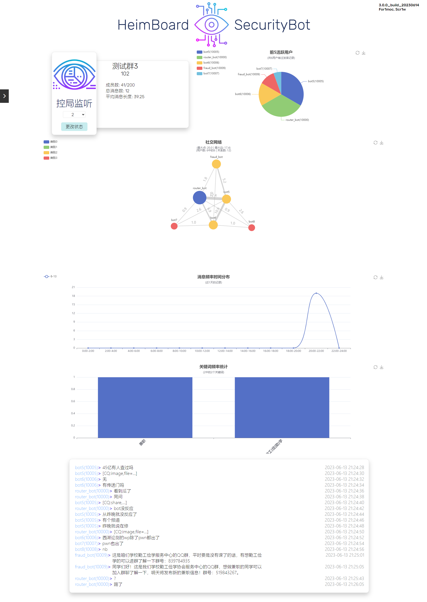

# 泛软院群聊初级测绘报告

## 报告摘要

版本：Heimbot3.0.0_build_20230614

时间：2023.6.14 - 2023.7.14

说明：对软院相关的部分公共群聊进行的初步数据收集与整理分析，数据脱敏后作为典型样本或测试用例，为进一步的各类分析提供数据基础

注意：由于受到数据收集粒度的限制，此数据报告内容不一定完全反映真实情况，可能存在一定偏差

## 数据样例

## 详细数据

### 基础数据

| 群聊       | 成员数    | 总消息数 | 平均消息长度 |
| ---------- | --------- | -------- | ------------ |
| 软\*\*\*忙 | 2956/3000 | 10372    | 60.82        |
| 大\*\*\*群 | 949/2000  | 27954    | 32.55        |
| 大\*\*\*） | 940/1000  | 841      | 118.44       |
| n\*\*\*群  | 1684/2000 | 5457     | 87.52        |
| 大***群    | 1542/2000 | 959      | 69.17        |
| 大***群    | 748/1000  | 774      | 58.65        |
| 软***群    | 1984/2000 | 858      | 3.77         |
| 大\*\*\*群 | 513/2000  | 701      | 62.10        |
| 大\*\*\*群 | 385/500   | 378      | 55.15        |

### 消息数据

| 群聊       | 存在发言记录的用户个数 | 单个用户最大发言次数 | 匿名消息发言次数 |
| ---------- | ---------------------- | -------------------- | ---------------- |
| 软\*\*\*忙 | 723                    | 870                  | 0                |
| 大\*\*\*群 | 101                    | 293                  | 25685            |
| 大\*\*\*） | 165                    | 54                   | 0                |
| n\*\*\*群  | 741                    | 144                  | 0                |
| 大***群    | 291                    | 28                   | 0                |
| 大***群    | 254                    | 24                   | 0                |
| 软***群    | 377                    | 16                   | 0                |
| 大\*\*\*群 | 49                     | 163                  | 0                |
| 大\*\*\*群 | 27                     | 133                  | 0                |

### 社交网络数据

| 群聊       | 最大点权值 | 最大边权值 | 用户数(点个数) | 关系数(边个数) |
| ---------- | ---------- | ---------- | -------------- | -------------- |
| 软\*\*\*忙 | 3319.3     | 488.8      | 723            | 1649           |
| 大\*\*\*群 | 7000.1     | 2258.8     | 101            | 83             |
| 大\*\*\*） | 240.7      | 53.5       | 165            | 289            |
| n\*\*\*群  | 503.1      | 227.8      | 741            | 1027           |
| 大***群    | 120.2      | 11.2       | 291            | 449            |
| 大***群    | 108.0      | 13.0       | 154            | 394            |
| 软***群    | 69.5       | 4.2        | 377            | 487            |
| 大\*\*\*群 | 554.9      | 366.3      | 49             | 144            |
| 大\*\*\*群 | 390.7      | 286.7      | 27             | 67             |

### 消息分布时间序列数据

| 群聊       | 发言频率最高时间段 | 发言频率最低时间段 |
| ---------- | ------------------ | ------------------ |
| 软\*\*\*忙 | 12:00-14:00        | 4:00-6:00          |
| 大\*\*\*群 | 20:00-22:00        | 4:00-6:00          |
| 大\*\*\*） | 14:00-16:00        | 4:00-6:00          |
| n\*\*\*群  | 12:00-14:00        | 4:00-6:00          |
| 大***群    | 14:00-16:00        | 4:00-6:00          |
| 大***群    | 18:00-20:00        | 4:00-6:00          |
| 软***群    | 20:00-22:00        | 4:00-6:00          |
| 大\*\*\*群 | 12:00-14:00        | 4:00-6:00          |
| 大\*\*\*群 | 20:00-22:00        | 4:00-6:00          |

## 典型诈骗引流消息

> 有想勤工俭学的同学联系我 不用出校 200/天 一做 一结（名额有限）

> 要10个勤工俭学的同学（男女生不限），晚上、周末空闲就行，150-200/日，线上无需出校门，dd我

> 这是咱们勤工俭学服务中心的QQ群，平时要是没事想做兼职的话可以进群了解一下
> 群号：xxxxxxxxx

> 同学们好[CQ:face,id=341]
> 这是咱们勤工俭学服务中心的QQ群，平时要是没有课了的话，有想勤工俭学的可以进群了解一下
> 群号：xxxxxxxxx
>

> @全体成员 同学们全部进下群明天兼职发放这是学校勤工俭学中心的QQ群，平时要是没有课了的话，有想勤工俭学的同学可以进群了解一下
> 群号:xxxxxxxxx
> (已报备，管理勿撤)

> 勤工服务中心
> 【第六期校园线上勤工助学】活动来喽
> 应同学们要求，开展线上勤工活动，改善同学们的生活和学习条件。
> 活动时间:节假日、周末、暑假，时间自由均可做
> 薪资待遇:日结或者周结价格几十到几百不等
> 欢迎感兴趣的同学进群了解，我们期待你的到来!QQ:xxxxxxxxx

> 这是咱们学校勤工俭学服务中心的QQ群，暑期有想勤工俭学的可以进群了解一下，在家没事不如把下学期学费、生活费挣出来，为父母减轻负担！
> (在家、留校都可以做)
> 群号：xxxxxxxxx

> @全体成员
> 24考研同学可以移步新群：xxxxxxxxx
> 1.各种大家复习需要的文具用品，1.9元三支的晨光笔，2.9元一百张的晨光A4纸等等
> 2.我们为大家准备了正版资料，涵盖英政数及全部专业课，全部白菜价！买书不花冤枉钱！
> 3.公共课资料都是我们呕心沥血整理出来的！各个学院专业课资料免费领取！
> 4.无套路，只为大家更好的学习！
> 5.学长学姐全程指导大家考研，为大家上岸保驾护航！
> 24考研同学可以移步新群：xxxxxxxxx

> 紧急通知：
>          同学们可以进一下我们学院活动交流群，该群群主要用于发放通知,同学之间交流等，主要为同学们提供技能辅助，考试信息发布，学习资料分享等助学内容，不得发布与学习无关的内容哦，请各位同学积极进群

> 注意
> 本校学姐联合驿站建立了新学期跳蚤. 市场，大家都可以进来看看！
> 裙号;xxxxxxxxx
> 宿舍用品都有
> 各种专业书籍都有
> 台灯9.9，A4纸100张2，护肤化妆品，良品铺子19一箱，星火英语四六级，教资，会计资料考研考公全部9.9一套，卷纸5亓一提

> 今年确定考大连理工的同学请速加xxxxxxxxx，可提供各专业初试和复试内部资源，初试单门专业课往年平均分均在130+，复试上岸率接近100%，各专业名额有限，验证消息请备注”大连理工考研”