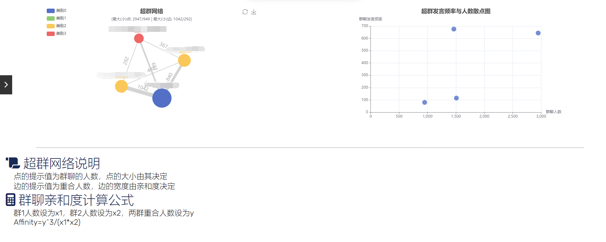

<b style="font-size:2.5em;line-height:1em;font-weight:700">基于go-cqhttp的社交平台反诈风控机器人</b>

<b style="font-size:1.2em">Anti-fraud risk control Internet bot on social platform based on go-cqhttp</b>

<b>电子邮箱：2097517935@qq.com</b>

<b>提交日期：2023.08.09</b>

<b style="font-size:1.5em">摘要</b>

​	本文首先介绍了社交平台黑灰产的基本概念、运行流程等，然后提出了本文针对该问题的一些解决方案。我们基于go-cqhttp接口在某社交平台上经过半年以上的数据收集、建模与分析工作，在这些数据的基础上进行了：多维数据的分析与可视化，用以为进一步构建解决方法提供基础；BERT预训练模型+自制数据集微调，应用于用户文本内容涉诈识别；FFT快速傅里叶变换+ACF自相关算法，应用于用户发言时间序列来查找离群用户。我们开发前后端以及模型算法端，建立了一个完整的涉诈分析与风控一体化系统，并对其进行了模拟环境与真实环境的系统测试，以及压力测试等各类测试。最后我们还就此系统的漏洞与不足展开讨论，指出若干可改进的方向，以及这些想法实际实施的难点。

**关键词：黑灰产；社交平台；可视化；BERT；FFT快速傅里叶变换；ACF自相关；**

<b style="font-size:1.5em">目录</b>

[TOC]

## 概述

### 背景与研究动机

​	随着进入21世纪以来，社交网络已经成为人们日常生活中不可或缺的一部分，为人们提供了方便快捷的交流和信息分享渠道。然而，随着社交网络的普及和使用规模的不断扩大，黑灰产也逐渐从短信诈骗领域渗透到这个领域。电信诈骗的典型范例是通过短信渠道的诈骗骚扰，但是由于国家对传统电信诈骗的严格管制和普通群众对传统电信诈骗的防范意识的提高，传统电信诈骗的活动受到了一定程度的遏制。相比之下，基于社交网络的黑灰产活动更加主流和活跃，也更加难以治理。

​	黑灰产转移阵地的原因除了传统领域受到高压管制以外，还有社交网络本身的吸引力。社交平台满足了城市青年拓宽社交圈和找陌生人倾诉的需求，但由于其天然的婚恋交友属性，导致成为色情/广告引流、以及杀猪盘/杀鱼盘/杀鸟盘等欺诈类黑产频繁入侵的重灾区。其中最典型的当属恶意引流。诈骗者通过引流脚本、群控、模拟器、多开软件等软硬件结合，操纵大量垃圾小号在社交平台的私信、个签、评论、发帖等场景进行批量色情/广告引流。

​	去年腾讯QQ被大规模盗号的事件就是一个典型例子。该事件具体发生在2022年6月26号22点左右，事件现象是很多大学校园相关的QQ群里很多正常用户的QQ号被非法盗用，并被脚本操控发送引流色情图片。事件的上游疑似为学习通APP自身的大规模账号数据泄露，导致众多大学生的其它平台账号被撞库攻击，最后由于各大平台账号密码相同，导致被盗号。平时也有很大一部分垃圾小号在人数较多、限制宽松的社交网络环境中进行批量引流，这些低成本的小号如同牛皮藓一样挥之不去，让社交网络中的正常用户叫苦不迭，非常影响正常的网络秩序。

​	近几年来社会经济下行压力增大，经济增长放缓导致企业裁员幅度增大。很多低素养、低技术能力的失业人员迫于经济压力，很有可能会从事一些违法犯罪活动，成为社会的不稳定因素，而其中一部分人会流入社交网络相关的黑灰产中。未来随着失业者的增多，社交网络上的黑灰产规模会越来越大，社会也愈发需要关注和治理这些方面。

​	总之，社交网络黑灰产频发的背景下，我们对这个新生领域产生了兴趣与想法，我们也认为有必要深入研究这一问题，探索优秀的解决方案，维护社交网络的健康发展，促进社会信息环境的良性发展。

### 项目创新工作与优势

创新工作：

1. bert-base-chinese预训练模型+自制数据集微调，应用于用户文本内容涉诈识别。
2. FFT快速傅里叶变换+ACF自相关算法，应用于用户发言时间序列来查找离群用户。
3. 超群亲和度算法与超群网络生成，应用于寻找同质性高的群组，可用于同质涉诈群组的发现。

优势：

1. 由于相关数据集稀缺，数据集由自己收集并处理，相较电信诈骗等数据集，对社交平台的涉诈检测很有针对性。
2. 不仅仅关注用户的发言内容，还对用户的行为时间序列进行了检测（很有价值的信息，且不容易被伪造，但是常常被忽略），使得检测结果可信程度和可解释性显著提高。

### 应用前景

​	本项目探索了在社交平台上检测涉诈用户的方法。这些方法为未来的风控和打击作弊用户提供了一些思路和解决方案，可以期待以下可能应用前景：

1. 诈骗用户检测与预防：通过本项目所探讨的涉诈用户检测方法，社交平台可以更精准地辨别潜在的诈骗行为，降低用户遭受损失的风险。这种预防性的措施有助于维护平台的信誉，保护用户的合法权益。
2. 风险管控策略升级：本项目提供的思路和解决方案为社交平台的风险管控策略升级提供了基础。平台可以借鉴并适应这些方法，不断优化其风险管理体系，降低虚假信息和不良行为对平台生态的影响。
3. 用户体验提升：引流和涉诈用户的存在直接影响用户体验。通过有效对诈骗用户的排查，社交平台可以净化用户环境，提供更真实、有趣、安全的社交体验，增强用户粘性和忠诚度。
4. 数据分析和智能决策：本项目涉及的方法和技术有助于社交平台进行更深入的数据分析，为平台运营提供更多有价值的信息。通过对用户行为的准确分析，平台可以做出更智能的运营决策，实现精准推荐和个性化服务。

## 黑灰产前瞻

### 黑灰产简要介绍

#### 黑灰产是什么

​	黑灰产（Black and Gray Industry）是指利用互联网平台进行非法、违规或欺诈性活动的产业。黑灰产包括黑产（Black Industry）和灰产（Gray Industry）两个概念。

​	黑产指的是以非法手段在互联网上从事各种违法犯罪活动的产业。这些活动包括但不限于网络诈骗、网络赌博、非法贩卖个人信息、恶意软件传播、非法网络交易等。黑产往往通过欺诈、偷盗、虚假宣传等手段牟取非法利益，对用户、企业和社会造成严重的经济和社会危害。

​	灰产指的是在互联网上进行的一些违规活动，尚未明确违法但存在一定的法律、道德风险的产业。这些活动可能存在法律漏洞或监管不完善，让从业者利用这些漏洞进行牟利。例如，一些灰产活动包括虚假广告、不合规的推广手段、违规内容传播等。灰产的存在使得从业者在法律边缘徘徊，规避监管的同时也给用户带来不良影响。

​	黑灰产的兴起与互联网的快速发展密切相关，互联网的开放性和匿名性为黑灰产提供了一定的便利条件。黑灰产对互联网的健康发展和用户权益构成威胁，也对正常商业竞争和市场秩序造成破坏。

#### 黑灰产非法牟利的手段

​	黑灰产为了实现非法牟利目的，采用了多种手段。以下是一些常见的手段：

1. 网络诈骗：黑灰产通过虚假宣传、冒充他人身份、利用社交工程等手段诱骗用户提供个人敏感信息，例如银行账户、密码、身份证号码等，进而非法获取财物。
2. 刷单和刷点击：黑灰产利用自动化软件或人工手段，大量制造虚假的交易或点击量，以提高产品或网页的曝光度，骗取广告费用或提高销量。
3. 假冒和盗窃：黑灰产制作假冒的网站、品牌和产品，冒充正规机构或企业，骗取用户信任并获取他们的财务信息或支付信息。
4. 虚假广告：黑灰产利用虚假、夸大的宣传手法，在广告中推销低质量或不存在的产品或服务，欺骗用户进行购买。
5. 虚假交易和网络赌博：黑灰产通过操纵交易数据、虚构交易行为，或者在互联网上组织非法赌博活动，以非法获利。
6. 销售非法商品或服务：黑灰产销售各种非法商品或服务，包括仿制品、非法药品、色情、赌博等，违反法律法规并损害用户权益。
7. 销售个人信息：黑灰产非法获取和销售用户的个人信息，包括姓名、手机号码、地址等，用于进行垃圾短信、诈骗或其他非法活动。

​	需要注意的是，以上手段仅是一些常见的黑灰产手段，黑灰产将会随着互联网的不断变化而进化，可能会采用新的手段和技术来实现非法牟利的目的。

### 互联网社交平台上黑灰产的运行流程

​	社交平台由于天然的聊天属性，导致变成了黑灰产广告引流、杀猪盘诈骗最严重的地方。以社交平台中真实用户为目标的黑灰产的运行流程如下：

1. 黑灰产上游账号商人注册大量的虚假账号，然后把这些账号卖给中游引流团伙
2. 引流团伙利用自动化工具和脚本批量的给平台用户发“领四六级资料”或者“勤工俭学/做兼职”等消息内容进行引流到微信群、QQ群甚至其它私人平台
3. 下游诈骗团伙在微信、QQ或者私人平台上对引流成功的账号以各种方式进行诈骗

<i>图1 互联网社交平台黑灰产运营流程</i>

​	当目标受害用户被引流离开社交平台后，一切行为将由引流团伙主导，导致其行动相较社交平台上更加隐蔽，更难被发现。故如果需要对黑灰产的流程进行检测与阻断，则阻断进行在引流以及大量虚假账号的注册这两个环节将最为有效。

​	本文仅探讨针对引流途径的发现与检测。

<i>图2 针对黑灰产运营流程的两个重要阻断途径</i>

### 引流逻辑与心理攻势

#### 兼职利诱

​	以勤工俭学/兼职赚外快为由，大规模发布相关的招聘广告进行引流，随后令目标群体下载各种非法团购APP进行刷单操作等等进一步的收割[^1]。

​	站在诈骗者角度：

1. 诱人的兼职机会：诈骗者发布看似真实的兼职工作机会，通常涉及高薪、灵活的工作时间和轻松的任务。这些工作机会常常被标榜为勤工俭学或额外收入的好方法，以吸引对此感兴趣的人。
2. 低成本宣传：诈骗者常使用由定时脚本操纵的虚假账号在社交媒体内群发广告消息，能够低成本的广泛宣传，进行广撒网。
3. 紧迫感和限时优惠：诈骗者可能采用限时优惠或紧迫感的策略，例如声称只有少数名额可用，或只在有限的时间内接受申请。这种心理策略可以迫使人们匆忙做出决定，从而减少他们对风险的深思熟虑。

​	站在易受骗者角度：

1. 渴望额外收入：许多学生群体对额外的收入持有渴望，尤其是对低投入高回报的工作怀有幻想。诈骗者会利用这种心理状态，承诺轻松获得高薪的机会，从而引起人们的注意并激发他们的兴趣。

#### 假冒权威

​	以假冒权威的话术开头，诈骗者假冒学校内的各种权威，比如学长学姐、勤工俭学相关部门、网信中心机构等。接下来组合别的利诱方式，进行实际的引流诈骗。

​	站在诈骗者角度：

1. 基于身份的认同和信任：诈骗者试图建立与目标人群的身份认同感和信任关系，通过制造与他们相似的身份或背景，并利用他们对社交证据和推荐的信任，使人们更容易上当受骗。例如最容易的方式是冒充已毕业的学长学姐，讲述一些自己的学习经历等，进一步自证并拉近与目标的关系。
2. 信息不对称性：诈骗者常常宣称自己是某权威，或与某权威有某种特殊联系，同时有一定的伪装技术。在与诈骗者的虚拟账号的私下匿名对话情况下，易受骗者的信息不对称，这种信息不对称导致易受骗者无法轻易核实权威的信息是否伪造。

​	站在易受骗者角度：

1. 信任权威：学生尤其是低年级新生倾向于信任权威机构或学长学姐的信息和建议。诈骗者利用这一心理倾向，通过假冒权威身份来获取目标人群的信任，使他们更愿意相信和参与诈骗计划。
2. 缺乏核实意愿与手段：学生尤其是低年级新生在面对一个所谓权威时，缺乏第三方网络信息搜集的核实意愿与足够的核实手段，常常不会额外去调查对方机构与身份是否合乎规章制度。

#### 推销资源

​	诈骗者极力鼓吹某技能的作用，极力夸大某些声称自己独有的资料的价值。过分夸大社会竞争压力，渲染焦虑氛围，从而以高价格卖出低成本的资源[^2]。

​	站在诈骗者角度：

1. 虚假的资源价值：诈骗者通过各种渠道推销所谓的高质量资源，如四六级资料、教资考试材料等，声称这些资源能够帮助目标人群轻松通过考试并取得好成绩。过分夸大资源的价值和效果，以吸引学生购买。

​	站在易受骗者角度：

1. 学业焦虑：学生群体由于受到各种升学的压力与考核，以及受到社会对学生群体的唯成绩论的影响，对自己的学业容易产生无由头的严重焦虑。因而容易相信并愿意付出一定的代价获取各类所谓独家资源，以及被严重夸大价值的各类资料。

#### 亚文化社团

​	诈骗者将自己伪装成某种亚文化社团的爱好者，以亚文化的传播以及共同的爱好为由进行引流，并进一步组织非法活动来收割。

​	站在诈骗者角度：

1. 虚假的亚文化社团身份：诈骗者可能以虚构或冒用真实亚文化社团的身份，或者直接使用简单的名称，例如漫协、交友会等，以吸引目标人群的兴趣和参与。他们可能制作虚假的宣传资料、网站页面，宣称提供与亚文化相关的交流、活动或资源。

​	站在易受骗者角度：

1. 归属感和社交认同：亚文化社团通常是志同道合者相聚的场所，参与者渴望融入和获得归属感。诈骗者利用这种心理需求，声称他们的社团是一个热情友好的社区，加入后可以获得与同好的交流和互动，满足人们的社交认同需求。
2. 热门话题和兴趣追求：亚文化社团通常围绕热门的话题、兴趣爱好或时下流行的动漫、漫画等展开。诈骗者利用这些热门话题和兴趣追求，宣称他们的社团是追求潮流、分享热门资讯的理想场所，吸引目标人群的注意力。

### 引流媒介与具体方式

#### 群内广播

​	群内广播主要指的是涉诈账号进入目标群，在群内发言，进行引流消息内容的广播。除文字格式以外，同时还会附上图片、群聊分享链接、钓鱼文件等多类型多模态的组合拳。
​	要注意的是这种方式很容易使用脚本来控制账号进行定时任务的消息发送，使得该方式成本很低。
​	这种方式针对新生群、考研群等规模比较大且进入门槛比较低的社交群聊效果很好。新生群、考研群基本上是一个松散的社交组织，群内成员互相比较陌生，还没有建立起一个统一的群内秩序，容易滋生各种引流与黑灰产账号。

#### 群体邀请

​	群体邀请主要指的是涉诈账号进入目标群，对所有群内成员进行邀请入群的发送，试图直接邀请目标进入引流群。
​	这种方式同上，很容易使用脚本批量操作。

#### 私聊

​	私聊主要是涉诈账号进入目标群与目标进行群内私聊，或者是在引流群内对被引流进来的目标进行群内私聊，进一步引流。
​	这种方式大部分是人工进行，也有一部分使用脚本来发送固定的引流文字序列。

#### 公众号

​	公众号，或类似公众号效应的账号，一般常见于校园墙、表白墙等形式。该账号首先在各个泛校园社交群聊内引流校园墙的账号，宣称为校友交流、公布有用校园信息为由，类似打着“交友表白”“校友互助”旗号，利用学校名称、标志或别称，以“校内公共平台”自居。常见的名字包括但不限于某某学校“表白墙”“表黑墙”“树洞”“万能墙”“墙墙墙”等[^3]。	
​	这类自媒体账号借用学校名号，对校内学生有一定影响力，但又通常未获得学校授权，有时候运营团队甚至全部由校外人士组成。这些人员素质参差，企图不明，外加缺乏有效监管，使得各种校园墙一度成为广告营销、黑灰产、造谣信息以及网络暴力的温床。
​	注意，虽然校园墙很多时候不一定是完全打着黑灰产的目的而经营，但鉴于其舆论影响力之大，不得不提防其无意的进行不良舆论导向，或沦为其它黑灰产的引流工具。

### 具体真实案例

#### 免费教修图/剪辑等技能

| 引流逻辑          | 具体方式 |
| ----------------- | -------- |
| 假冒权威+推销资源 | 私聊     |

​	假冒校友身份，利用修图、视频剪辑、插画等技能免费教学来诱惑目标，进行第一步的引流

<i>图3 引流实例之免费教修图/剪辑等技能</i>

#### 漫协纳新

| 引流逻辑       | 具体方式 |
| -------------- | -------- |
| 亚文化社团纳新 | 群体邀请 |

​	直接在目标群内进行邀请进群的批量操作

<i>图4 引流实例之漫协纳新</i>

<i>图5 引流实例之漫协纳新</i>

#### 勤工俭学/兼职广告

| 引流逻辑          | 具体方式 |
| ----------------- | -------- |
| 假冒权威+兼职利诱 | 群内广播 |

​	冒充勤工俭学相关部门，以勤工俭学/兼职等为诱惑，群内发消息打广告

> 有想勤工俭学的同学联系我 不用出校 200/天 一做 一结（名额有限）

> 勤工俭学十人 日结180+(周末双倍) 无押 暑假也可做 当天结

> 要10个勤工俭学的同学（男女生不限），晚上、周末空闲就行，150-200/日，线上无需出校门，dd我

> 这是咱们勤工俭学服务中心的QQ群，平时要是没事想做兼职的话可以进群了解一下
> 群号：xxxxxxxxx

> 同学们好呀
> 这是咱们学校的勤工俭学协会服务中心QQ群，平时要是没有课了的话，有想勤工俭学的可以进群了解一下哈，明天周四将发布兼职信息♥欢迎👏👏
> 群号：xxxxxxxxx

<i>图6 引流实例之勤工俭学</i>

## 系统设计

​	本系统的架构设计共有如下四个模块：

1. 数据收集与转发端：模拟社交平台的客户端，自动收集和转发社交平台群的消息数据到后端，由后端进行数据处理。
2. 后端：包括业务逻辑代码和数据源，主要负责收集与维护数据、向前端返回要展示的数据、向模型和算法发送待检测的数据等。
3. 前端：用于可视化数据的展示与方便管理员快捷管理系统。
4. 模型与算法端：用于根据收集的原始数据进行涉诈行为的检测，主要由针对文本内容的涉诈识别模型与针对用户行为时间序列的检测算法构成。

<i>图7 系统网络逻辑架构图</i>

### 架构设计

​	本节遵循注重数据本身，以及数据流的流经途径这个视角来解释本项目的架构设计，其中包含：

1. 数据单元的定义：社交平台上最基本的数据单元是什么，以及构成这个最基本数据单元的要素是什么。
2. 场景单元的定义：社交平台上最基本的场景是什么，以及构成这个最基本场景单元的要素是什么。
3. 数据的收集和展示：数据是如何被收集和如何被展示的，从哪来到哪去。

#### 数据单元的定义

​	我们定义的数据单元可以理解为一个事件，这个事件是某群聊里某用户在某时间发送了某一条消息。这样一个事件有如下四个基本要素：

| 要素    | 说明               |
| ------- | ------------------ |
| groupID | 群聊ID，唯一标识符 |
| userID  | 用户ID，唯一标识符 |
| time    | 发送时间           |
| content | 消息内容           |

<i>表1 数据单元的基本要素</i>

​	并且除了纯文本以外，发送其他媒介的信息也可以抽象的认为是发送消息。例如发送表情、图片、邀请链接等等内容在社交平台当中都是被一种编码所表示的，本质上还是文本内容。例如QQ中这些内容被CQ码表示，在QQ客户端中被解析。

#### 场景单元的定义

​	场景单元是具有社交现实意义的，一个相对闭环的基本单元。只有数据单元意味着仅单一用户发消息，不具有社交意义。而两个或多个用户处在同一个互相可见发言消息的环境中，这样的场景是具有社交意义的，并作为基本的社交场景。常见的比如QQ群聊、微信群聊、私聊（两个用户组成的群聊）、频道、帖子等。

| 要素     | 说明                       |
| -------- | -------------------------- |
| groupID  | 群聊ID，唯一标识符         |
| []userID | 参与本群聊社交的用户ID列表 |
| messages | 本群聊的历史消息记录       |

<i>表2 场景单元的基本要素</i>

​	参与本群社交指的是对社交环境产生影响的用户，可以简单理解为至少有发言记录的用户，并且至少有一个其他用户不无视该用户的至少一条发言记录。

#### 数据的收集和展示

**数据的收集**

​	数据通过模拟社交平台客户端的接口转发给后端，后端从转发过来的网络数据包里接收数据，例如从路由上的HTTP POST请求里接收数据。

​	后端接收到数据后，进行一系列业务逻辑的执行，并与数据源交互，包括保存数据、对数据分类、计算和维持附属数据等。

**数据的展示**

​	前端首先向发起HTTP请求，后端根据请求类型执行不同的业务逻辑，和数据源交互，取出需要展示的数据，通过HTTP响应返回给前端。

​	前端接收到HTTP响应后，从里面取出数据，在浏览器进行渲染并显示。

### 算法设计

​	除了最基本的原始数据的收集与存储，以及第一等的，能够被一个字段所存储的附属数据的维护以外（群聊消息总数、群聊消息平均长度等），以下还有不能仅被一个字段所存储的第二等数据：关键词捕捉、社交网络、超群网络。为了维护并存储这些数据，无法使用最简单的增删改查来进行，需要运行一些算法。

#### 关键词捕捉

​	关键词捕捉的算法是当中最简单的，我们维护一个可以增删改查的关键词词表。当每条消息来临时，对这条消息内容进行基于该关键词词表的正则表达式匹配，得出该条消息中各个关键词的词频，然后就这些词频结果进行记录和存储。

#### 社交网络生成

​	社交网络的数据模型是以用户之间的关系为基础单元存储的，通过多个不同用户间的关系，我们可以生成一个群聊内的社交网络图。

| 数据域  | 说明                 |
| ------- | -------------------- |
| groupID | 群聊ID               |
| userID1 | 用户1的ID            |
| userID2 | 用户2的ID            |
| value1  | 用户1对用户2的倾向值 |
| value2  | 用户2对用户1的倾向值 |

<i>表3 社交网络关系的数据模型</i>

​	用户之间的关系在群聊中可以简单体现为消息序列的上下文互动，在一个上文最大影响条数范围内，当前发送消息的用户都会施加对上文用户的倾向值，这个倾向值随着靠近该条消息的上文距离增大而递减。

<i>图8 社交网络数据处理原理示意图</i>

​	此外，我们还会衡量每个用户的关系的是否广博。如果把关系的权值，即牢固程度看成边的宽度，则用户的权值，即拥有关系的广博程度可以看成点的大小。这里我们每次处理新消息都累加该用户对其它用户的倾向值，来更新用户的权值。

#### 超群网络生成

​	超群网络是一个描述一些群聊之间关系的关系图，与单一群聊的社交网络类似。它的点是群聊，边是群聊之间的关系，点的提示值为群聊的人数，点的权值（大小）由其决定，边的提示值为两群聊的重合人数，边的权值（宽度）由亲和度决定。其中亲和度计算公式如下：

| 变量        | 说明         |
| ----------- | ------------ |
| group_num1  | 群1人数      |
| group_num2  | 群2人数      |
| overlap_num | 两群重合人数 |

<i>表4 群间亲和力公式变量说明</i>
 

$$
Affinity=\frac{overlap\_num^3}{group\_num1*group\_num2}
$$

$$
=\frac{overlap\_num}{group\_num1}*\frac{overlap\_num}{group\_num2}*overlap\_num
$$

​	亲和力公式的解释：两个群间重合人数越多，同时重合人数占本群人数的比例越大，则认为它们之间同质性较强，群间亲和力也就越大。

​	超群网络图的一个主要功能是发现若干相近群聊中的主要群与次要群，以及它们之间的亲和力即关联有多大。当一个群聊内出现涉诈事件时，通过此超群网络图能够评估其它群的可能受到的威胁风险。

​	典型的一个涉诈场景是XX高校23考研群与XX高校24考研群，这两个群的同质性非常高，并且都很容易有垃圾小号进入发送涉诈消息。我们就能通过超群网络经其中一个群发现另一个群。

#### 文本检测模型

​	该算法的核心思想是，训练一个文本多分类神经网络，对可能的涉诈文本进行分类。即一条消息能够被该模型经过处理，然后给其打上标记，标明是否为涉诈消息。	若是，则将：

1. 特别存储该消息记录。
2. 将发送该消息的用户标记为关键用户，实时记录其更细粒度的数据。
3. 将该条消息中可能的引流目标群聊ID存储到黑名单中，并记录和存储`<用户ID，引流目标群聊ID>`这样的键值对。

以下是常见的神经网络训练步骤：

1. 数据收集与预处理
   - 收集文本数据集，其中包含输入文本和相应的分类标签。
   - 清洗文本数据，去除不必要的标点、特殊字符和HTML标签等。
   - 分词：将句子分解为单词或子词，这通常涉及到使用分词器或者标记化工具。
   - 构建词汇表：将所有不同的单词映射到唯一的整数标识，形成词汇表。
2. 数据编码与向量化
   - 将文本数据转换为模型可以处理的格式，例如将单词转换为对应的整数标识。
   - 对输入进行填充或截断，确保所有输入序列长度相同。
3. 标签编码
   - 将分类标签转换为模型可以理解的形式，通常使用独热编码（one-hot encoding）或者整数编码。
4. 模型构建
   - 选择适当的神经网络架构，常见的选择包括循环神经网络（RNN）、长短时记忆网络（LSTM）、门控循环单元（GRU）和卷积神经网络（CNN）等。
   - 建立嵌入层：将整数编码的单词映射为密集向量，这有助于捕捉单词之间的语义关系。
   - 添加多个隐藏层：这些隐藏层可以是RNN、LSTM、GRU、CNN等，用于学习不同级别的特征表示。
   - 输出层：根据任务需要选择合适的激活函数和神经元数量。
5. 模型编译
   - 定义损失函数：适用于多分类问题的常见损失函数包括交叉熵损失函数。
   - 选择优化器：常用的优化器有随机梯度下降（SGD）、Adam、RMSprop等。
   - 定义评估指标：例如准确率、精确率、召回率等。
6. 模型训练
   - 使用训练数据进行模型训练，通过反向传播算法不断调整模型参数以最小化损失函数。
   - 可以使用批量训练（mini-batch training）来提高训练效率和稳定性。
7. 模型评估与调优
   - 使用验证集对模型进行评估，监控损失函数和评估指标的变化。
   - 根据验证结果进行模型调优，可以尝试调整超参数、改变网络结构等。
8. 模型预测与部署
   - 使用测试数据对最终模型进行评估，确保其在新数据上的表现。
   - 将模型部署到实际应用中，进行实时预测或推断。

#### 时间序列检测算法

​	该算法的核心思想是，正常用户和涉诈脚本用户是两个群体，尤其在发言时间序列上会有偏离。正常用户常常单条消息长度较短、在聊天时短时间发送消息数量较多、同时和别的用户会有强烈的上下文消息交织。涉诈脚本用户往往每天固定时间，由脚本操控发送两三条比较长的引流消息。

​	我们思考找出整个群聊用户群体时间序列的一个典型均值代表，用这个时间序列去和每个用户单独的时间序列进行求均方误差。然后求这些均方误差的均值和方差，能够构成一个正态分布。找出均方误差最大的用户，或者均方误差大于$μ+2σ$的用户，即视为离群用户。

​	注意，虽然我们的假设是正常用户和涉诈脚本用户的行为是有很大区别的，导致各自时间序列也有很大偏差，但是离群仍不一定代表涉诈。

## 系统实现

### 架构实现

​	根据先前的系统设计，分别对不同的模块进行了如下具体实现：

1. 数据收集与转发端：使用开源的go-cqhttp框架模拟QQ客户端，自动转发QQ群的消息数据到后端，并能够接收后端的指令进行主动的消息发送。
2. 后端：由业务逻辑部分（Gin框架开发，RESTful API）与数据源部分（MySQL）组成，主要负责收集与维护数据、向前端返回要展示的数据、向模型发送待检测的数据等。
3. 前端：由vue3框架开发，用于可视化数据的展示与方便管理员快捷管理系统。
4. 模型与算法端：主要由针对文本内容的涉诈识别模型与针对用户行为时间序列的检测算法构成，其搭载在flask框架开发的RESTful API上

#### 数据收集与转发端实现

​	针对QQ软件，我们使用开源的go-cqhttp框架，使用理由主要是该框架可以方便的模拟客户端登录QQ，并自动获取并转发群聊里的消息事件。同时，go-cqhttp框架没有过多的预设脚手架，方便我们自由发挥编写自己的功能。

​	以下是go-cqhttp能够获取的单条消息的json形式，即每有一个用户在某个群发送了某条消息后，都会有一个HTTP POST数据包搭载这样的json被转发到后端。

<i>图9 go-cqhttp获取的单条消息的json</i>

​	该json中包含`group_id`、`user_id`、`time`、`message`，对应上文中叙述的数据单元的四个基本要素：群聊ID、用户ID、发送时间、消息内容，这样能够确保满足我们的基本数据需求。

#### 后端主要业务逻辑流程实现

​	我们使用Golang以及Gin框架来构建后端。Go是一种强类型的编程语言，它在编译时能够捕获许多错误，从而提高了代码的稳定性和可靠性，适合充当大型项目稳定的后端服务。同时Gin框架是一个使用Go编程语言编写的Web框架，适用于构建高性能的后端应用程序，尤其是社交平台这样可能存在高并发的场景。其包括但不仅限于以下优势：

1. 高性能：Gin是一个轻量级的框架，专注于提供高性能的路由和中间件功能。它采用了一些优化策略，如基于Radix树的路由匹配，以实现更快的请求处理速度。这使得 Gin 在处理大量并发请求时表现出色。
2. 快速开发：Gin提供了简洁的API和路由设计，使得开发人员能够更快速地构建应用程序。它支持RESTful风格的路由和参数解析，从而减少了开发人员的繁琐工作。
3. 中间件支持：Gin具有强大的中间件支持，允许开发人员在请求处理的不同阶段插入自定义逻辑。这对于实现身份验证、日志记录、请求处理、错误处理等功能非常有用。

​	该后端根据前文的设计，主要承担两个功能：数据收集和数据展示。当其承担不同功能时，其业务逻辑的流程不同。

**数据收集**

​	项目的基本数据单元是消息事件，故我们以消息事件驱动的模式来设计后端，数据库除了存储数据之外，还充当白板系统。在接收一个消息事件时，数据库的不同状态会决定如何处置当前的消息事件。例如当时间序列缓存条数未到达阈值时，继续存储；当到达阈值后，将上一批时间序列缓存数据全部处理打包，发送到算法与模型端进行检测，并将返回结果存储。

**数据展示**

​	当后端执行数据展示的业务逻辑时，其仅仅是一个RESTful API，简单地提供需要展示的数据返回前端。同时还需要根据管理者的需要，从前端接收指令，进行一些数据的简单增删改查操作。

#### 数据库设计

​	本项目数据库的设计使用最常用的主从设计，分不同体系使用主从设计。例如群聊为核心时，我们将群聊当作主体，一个群聊一对多用户；当关键用户为核心时，我们将关键用户当作主体，一个关键用户一对多个群聊等等。

<i>图10 群聊为主体的体系相关的数据表</i>

​	

<i>图11 关键用户为主体的体系相关的数据表</i>

<i>图12 管理员数据表</i>

<i>图13 关键词数据表</i>

<i>图14 涉诈消息为主体的体系相关的数据表</i>

<i>图15 时间序列检测相关的数据表</i>

​	同时，本项目通过合理设计，支持开启一个模式，该模式下每个群组存在一个最大数据量限制，而不是能够无限存储数据导致可能的存储溢出风险。

​	一个聊天群组一般来说有最大人数上限，例如QQ群是3000人，那么这个群组最多会消耗以下存储空间：

- 3000条用户(GroupUser)数据记录
- $$\frac{3000*(3000-1)}{2}=4498500$$条社交网络关系(GroupGraph)数据记录
- {groupTimeLimit}条群组发言时间序列(GroupTime)数据记录，该变量由配置文件中人工确定
- {关键词表长度}条关键词(GroupKeyword)数据记录，这里关键词表由人工导入，故不会出人意料地导致数据过多而溢出
- {groupCacheMessageLimit}条缓存消息(GroupCacheMessage)数据记录，该变量由配置文件中人工确定

​	并且由于一个群内发言人数常常达不到接近总人数，故实际情况会比此理论上限小许多

#### 前端数据可视化实现

​	本项目使用的前端可视化工具是ECharts.js。ECharts（Enterprise Charts）是一个基于JavaScript的开源图表库，用于在Web应用程序中创建丰富多样的数据可视化图表。以下是 ECharts 进行图表表示的优势：

1. 多样性的图表类型：ECharts提供了多种图表类型，包括折线图、柱状图、饼图、雷达图、散点图、热力图等。这使得您可以根据数据的特性选择最适合的图表类型，从而更好地呈现数据。
2. 丰富的交互和动画效果：ECharts支持丰富的交互功能，如数据区域缩放、数据刷选、拖拽重计算等。此外，它还提供了平滑的动画效果，使图表的呈现更加生动和引人注目。
3. 支持大数据：ECharts在处理大量数据时表现出色。它采用了数据分片和异步渲染等技术，可以有效地处理包含数万甚至数十万数据点的图表，而不会影响性能。
4. 数据可视化：ECharts的目标是将数据转化为可视化的图表，从而帮助用户更好地理解数据、发现趋势和模式，以做出更明智的决策。

<i>图16 活跃用户扇形图</i>

<i>图17 消息频率时间分布折线图</i>

<i>图18 关键词统计柱状图</i>

### 算法实现

​	算法实现既可以放在gin框架的RESTful API上，也可以放在flask框架的RESTful API上，我们根据任务的不同要求来因地制宜的选择使用Golang还是Python进行开发。

#### 社交网络生成实现

​	前文设计部分说到，具有关系数据后，我们就能生成社交网络。而Eharts.js强大和多样的图表支持网络图的绘画，所以我们仍然选择ECharts.js来对这些数据图表进行表示。

<i>图19 社交网络图</i>

#### 超群网络生成实现

​	该计算流程实现的一个基础函数是：给定两个群ID，计算两个群的重合人数。通过这个基础函数，我们就能够给定若干群ID，遍历计算出这个超群网络图的数据基础，然后进行生成。

​	生成社交网络图的具体方法同上，我们使用ECharts.js。

<i>图20 超群网络图</i>

​	此视图除了超群网络图，还附带计算了这些群聊的人数与发言频率的散点图进行对比。

#### 文本检测模型实现

​	文本检测模型的实现，我们使用的是bert-base-chinese预训练模型。BERT（Bidirectional Encoder Representations from Transformers）是一种预训练的语言模型，通过双向上下文建模的方式在多个自然语言处理任务中取得了显著的突破。它之所以适合文本分类任务，主要有以下几个原因：

1. 双向上下文建模：BERT模型在预训练阶段使用了双向的上下文建模方式，即在处理每个单词时，它能够同时利用该单词之前和之后的上下文信息。这使得模型能够更好地理解单词的语义和上下文关系，有助于提取丰富的特征。
2. 预训练-微调框架：BERT通过在大规模文本语料库上进行预训练，学习了丰富的通用语言表示。然后，在特定任务上进行微调，将任务相关信息纳入模型。对于文本分类任务，可以将分类器添加到预训练的BERT模型的顶部，并在少量标注数据上进行微调，从而使模型更好地适应特定任务。
3. 多层抽象特征表示：BERT模型由多层Transformer编码器组成，每一层都能够逐渐抽象和整合输入文本的不同层次的特征。这使得BERT能够捕捉从词汇级别到句子和段落级别的特征，有助于更好地理解文本的语义。
4. 适应多种文本长度：BERT模型对于不同长度的文本具有良好的适应性。它使用了自注意力机制，可以处理不定长度的输入序列，不需要固定长度的文本输入。
5. 迁移学习效应：BERT在大规模的预训练阶段学习了丰富的语言表示，这使得它能够迁移学习到各种文本分类任务中。因此，当你面对一个新的文本分类任务时，可以通过微调预训练的BERT模型，从而减少训练时间和数据需求。

​	项目早期我们使用的是开源的电信诈骗数据集，进行预训练模型的微调。但是部署模型后，实际测试效果不佳。本质原因是电信诈骗主要是短信诈骗，短信诈骗的文本和社交平台的引流诈骗文本相似度并不高。

​	同时我们也尝试过搜寻社交平台的开源诈骗数据集，明显问题是这方面的数据集非常稀缺，github、kaggle、datafoutain以及别的平台都没有合适此场景的数据集。因而我们开始自己搜集数据，自制数据集，然后微调预训练模型。

​	使用有数据收集功能的本项目，我们进行了约半年的数据收集工作：

- fraud_msg.csv：从近半年的消息内容中人工收集包含勤工俭学、兼职等字样的引流诈骗消息，约200条。

- normal_msg.csv：从最近的20000条正常消息内容中分层抽样2000条。仅保留reply、at、face三种CQ码（较为常见和简短），而image、video、json等复杂CQ码由于长度过长会影响文本分类的精度，因此剔除。

将上面两个数据集随机混合在一起，形成一个基础版本的训练集，如下图：

<i>图21 处理后的训练数据集</i>

​	最后针对文本内容的解决方案是bert-base-chinese预训练+自制数据集微调的文本多分类模型，以下是模型结构：

<i>图22 BERT模型结构</i>

1. `self.bert = BertModel.from_pretrained(BERT_PATH)`: 这一层加载预训练的BERT模型，其中`BERT_PATH`是BERT预训练模型的路径。BERT模型能够将输入的文本序列转换为上下文相关的词向量表示。
2. `self.dropout = nn.Dropout(dropout)`: Dropout层用于随机地将一部分神经元的输出置为零，以防止过拟合。`dropout`是丢弃率，表示被置为零的神经元的比例。
3. `self.linear = nn.Linear(768, 2)`: 线性层用于将BERT模型的输出维度（768维）映射到最终的分类标签数目（2个类别）。这个线性层的权重将在训练过程中学习。
4. `self.relu = nn.ReLU()`: ReLU激活函数层将线性层的输出进行非线性变换，增加模型的表达能力。
5. `forward(self, input_id, mask)`: 此方法定义了模型的前向传播过程，输入包括`input_id`和`mask`。

- `input_id`是输入的文本序列，通常是经过分词和编码后得到的整数序列。
- `mask`是输入序列的掩码，用于指示哪些元素是真实的词汇，哪些是填充的。这是因为BERT模型要求输入序列的长度是固定的，因此需要用填充标记进行填充。掩码中为1的位置表示真实的词汇，为0的位置表示填充。

1. `_, pooled_output = self.bert(input_ids=input_id, attention_mask=mask, return_dict=False)`: 这一行使用BERT模型对输入序列进行处理。`input_ids`是输入的整数序列，`attention_mask`是输入序列的掩码。`return_dict=False`表示返回的结果是元组形式的输出。模型的输出包括两部分，第一部分是所有层的输出，第二部分是经过池化操作后的输出，也就是对输入序列的所有词向量取平均值得到的表示。
2. `dropout_output = self.dropout(pooled_output)`: Dropout层将池化后的输出进行随机丢弃一部分神经元的操作。
3. `linear_output = self.linear(dropout_output)`: 线性层将经过Dropout层处理后的输出进行线性变换。
4. `final_layer = self.relu(linear_output)`: 通过ReLU激活函数对线性层的输出进行非线性变换，得到最终的模型输出。

<i>图23 神经网络模块检测效果图</i>

#### 时间序列检测算法实现

​	根据上文的时间序列算法设计，我们需要先寻找一个方法，该方法计算整个群聊用户群体时间序列的典型均值代表。我们考虑使用FFT快速傅里叶变换+ACF自相关函数的算法。

​	FFT（Fast Fourier Transformation）：FFT是一种用于将一个时域信号转换为频域信号的技术。在时间序列分析中，我们可以将每个时间序列视为一个时域信号，通过将它们进行FFT变换，我们可以得到它们的频谱表示。当多个时间序列叠加在一起时，每个频率分量的幅度将会叠加。如果这些时间序列代表相似的事件或现象，它们在频域中的叠加将会强化共同频率成分，从而突出典型的特征。

​	ACF（Autocorrelation Function）：ACF是用来度量一个时间序列与其自身滞后版本之间的相似性的工具。通过计算一个时间序列与其滞后版本的点积，我们可以得到一系列自相关系数，表示了序列在不同滞后下的相似程度。当多个时间序列叠加在一起时，它们的共同特征将在自相关函数中表现出来。如果这些时间序列有相似的波动模式，它们的自相关函数在特定滞后上将表现出峰值，这些峰值可以用来推断出典型的重复模式。

​	结合使用FFT和ACF来计算典型均值代表的理由如下：

1. 频谱特征突出：FFT可以将时间序列转换为频谱表示，从而突出在频域中重要的共同频率成分。这可以帮助我们理解哪些频率对于代表典型模式是关键的。
2. 重复模式检测：ACF可以帮助我们识别时间序列中的周期性和重复模式。当多个时间序列叠加时，它们的共同重复模式将在自相关函数中得到强化，从而可以帮助我们找到这些模式并推断出典型的均值。
3. 综合信息：将FFT的频谱信息与ACF的自相关信息结合起来，可以提供更全面的视角来分析时间序列叠加的典型特征。频域和时域的信息可以相互补充，帮助我们更好地理解数据。

​	于是，我们应用FFT+ACF的具体步骤如下：

1. 假定我们设定一个时间序列周期是5天，那么我们首先获取一个群聊的整体时间序列数据，维度为`[1, 5 * 12]`。这里的时间序列横轴是5天内的时间段，2h为一个单位时间段，纵轴是群聊整体的消息频数。
2. 使用cubic样条插值法放缩到`[1, 1024]`维度，理由是FFT算法通常要求输入数据长度是2的幂。这是因为FFT算法的核心思想涉及将一个序列递归地分成较小的子序列，并在频域中合并它们。其次，将相对稀疏的时间序列进行插值并放缩到1024的长度，使得时间序列更密集，更利于进行下一步的均方误差计算。定义的所在区间是`[0, 1]`，即在`[0, 1]`取了1024个点，他们的纵轴值分别是上述的时间序列个值。
3. 从频谱中挑选功率最高的三个频率，计算他们的ACF自相关系数，挑选ACF的绝对值最大的频率，计算对应的振幅和相位，还原三角函数`triFunc()`，这个三角函数代表该群聊时间序列的典型均值。
4. 选取一部分有代表性的样本用户来代表该群的所有用户，原因是如果要计算所有用户和`triFunc()`的MSE，其计算量不可控，很有可能使内存溢出。主体样本用户我们可以使用发言频数排序，挑选其中一部分，然而我们考虑到涉诈用户在发言频数上通常不占优势，大概率会被排除。故我们还添加了涉诈关键词排序，由这两个主序组成，比例为8：2，样本用户占群用户的0.1（最小为10）。
5. 首先同样在`[0, 1]`上取`5 * 12`个点，对这个横轴序列应用`triFunc()`得到纵轴值，称其为`preds`，然后将用户时间序列S与`preds`进行均方误差的计算，即等价于公式$MSE=\frac{1}{n}\sum (S_i-triFunc(i))^2$，维度是`[1, 5 * 12]`。
6. 根据这些MSE的均值和方差构建正态分布模型，找出MSE最大的用户，即最离群的用户。再将其MSE与$\mu+\sigma$、$\mu+2\sigma$、$\mu+3\sigma$相比较，进一步确认是否真的足够离群。

<i>图24 时间序列模块检测效果图</i>

## 系统测试与分析

### 模拟环境测试

​	BERT模型的微调在验证集上的准确率，训练日志如下：

<i>图25 BERT模型训练在测试集上的准确率日志</i>

​	由于数据集过小，多样性不高（由于真实环境中脚本账号的涉诈消息多样性不高），可以看到训练5个Epoch后已经严重过拟合，并且其鲁棒性比较差，在遇到相近语句结构的同为涉诈消息时，或是参杂变体字时，准确率非常低。模型的训练上限受到数据集质量的限制，只有扩大数据集容量与多样性才能推进模型的准确率进一步提升。

​	我们从真实群聊环境中节选了若干片段，对其隐私内容进行了去敏感化处理：群名和用户名已被替换，引流群号使用随机生成的一段数字替代，如下图示例：

<i>图26 测试数据之群聊3</i>

​	然后使用PHP脚本就测试数据转换为针对go-cqhttp合法的JSON数据，对本机`127.0.0.1:8740`进行POST遍历。

<i>图27 模拟环境测试结果</i>

​	我们可以看到靠近末尾的两条涉诈消息被成功识别。消息内容被关键词表高亮处理，引流行为被引流日志记录，引流的涉诈账号自动被标记为关键用户。

### 真实环境测试

​	我们在2023.6.14 - 2023.7.14的一个月时间段内，对校园环境的部分公共群聊进行了初步数据收集，数据脱敏后抽取了其中连续的5天作为典型测试用例。

​	由于受到数据收集粒度的限制，此收集的环境数据不一定完全反映真实情况，可能存在一定偏差。

| 群聊       | 成员数    | 总消息数 | 平均消息长度 |
| ---------- | --------- | -------- | ------------ |
| 软\*\*\*忙 | 2956/3000 | 10372    | 60.82        |
| 大\*\*\*群 | 949/2000  | 27954    | 32.55        |
| 大\*\*\*） | 940/1000  | 841      | 118.44       |
| n\*\*\*群  | 1684/2000 | 5457     | 87.52        |
| 大***群    | 1542/2000 | 959      | 69.17        |
| 大***群    | 748/1000  | 774      | 58.65        |
| 软***群    | 1984/2000 | 858      | 3.77         |
| 大\*\*\*群 | 513/2000  | 701      | 62.10        |
| 大\*\*\*群 | 385/500   | 378      | 55.15        |

<i>表5 真实环境-基础数据</i>
 

| 群聊       | 存在发言记录的用户个数 | 单个用户最大发言次数 | 匿名消息发言次数 |
| ---------- | ---------------------- | -------------------- | ---------------- |
| 软\*\*\*忙 | 723                    | 870                  | 0                |
| 大\*\*\*群 | 101                    | 293                  | 25685            |
| 大\*\*\*） | 165                    | 54                   | 0                |
| n\*\*\*群  | 741                    | 144                  | 0                |
| 大***群    | 291                    | 28                   | 0                |
| 大***群    | 254                    | 24                   | 0                |
| 软***群    | 377                    | 16                   | 0                |
| 大\*\*\*群 | 49                     | 163                  | 0                |
| 大\*\*\*群 | 27                     | 133                  | 0                |

<i>表6 真实环境-消息数据</i>
 

| 群聊       | 最大点权值 | 最大边权值 | 用户数(点个数) | 关系数(边个数) |
| ---------- | ---------- | ---------- | -------------- | -------------- |
| 软\*\*\*忙 | 3319.3     | 488.8      | 723            | 1649           |
| 大\*\*\*群 | 7000.1     | 2258.8     | 101            | 83             |
| 大\*\*\*） | 240.7      | 53.5       | 165            | 289            |
| n\*\*\*群  | 503.1      | 227.8      | 741            | 1027           |
| 大***群    | 120.2      | 11.2       | 291            | 449            |
| 大***群    | 108.0      | 13.0       | 154            | 394            |
| 软***群    | 69.5       | 4.2        | 377            | 487            |
| 大\*\*\*群 | 554.9      | 366.3      | 49             | 144            |
| 大\*\*\*群 | 390.7      | 286.7      | 27             | 67             |

<i>表7 真实环境-社交网络数据</i>
 

| 群聊       | 发言频率最高时间段 | 发言频率最低时间段 |
| ---------- | ------------------ | ------------------ |
| 软\*\*\*忙 | 12:00-14:00        | 4:00-6:00          |
| 大\*\*\*群 | 20:00-22:00        | 4:00-6:00          |
| 大\*\*\*） | 14:00-16:00        | 4:00-6:00          |
| n\*\*\*群  | 12:00-14:00        | 4:00-6:00          |
| 大***群    | 14:00-16:00        | 4:00-6:00          |
| 大***群    | 18:00-20:00        | 4:00-6:00          |
| 软***群    | 20:00-22:00        | 4:00-6:00          |
| 大\*\*\*群 | 12:00-14:00        | 4:00-6:00          |
| 大\*\*\*群 | 20:00-22:00        | 4:00-6:00          |

<i>表8 真实环境-消息分布时间序列数据</i>
 

​	真实环境的测试结果见前文图16、图17、图18、图19、图23、图24，可以看到主动模拟引入的一个周期涉诈脚本用户，其同时被神经网络模块的文本分析和时间序列模块的时间序列分析所检测和捕获。

### 系统压力测试

​	系统计算压力主要来自如下几个算法：

1. 超群网络图的基础单元遍历计算
2. BERT模型的加载与批量数据预测

|                          | 2G内存 | 8G内存          | 2060 6G显存   |
| ------------------------ | ------ | --------------- | ------------- |
| Golang进行超群网络图计算 | 超内存 | 可行            | ——            |
| PHP进行超群网络图计算    | 可行   | 可行            | ——            |
| BERT模型的加载与预测     | 超内存 | 平均0.5条消息/s | 平均1条消息/s |

<i>表9 系统压力测试表</i>

​	需要说明的是，BERT模型的加载和预测的测试结果是建立在batch_size不过大的情况下，否则不论消息流量的大小都会崩溃。单次batch_size最好控制在30以内，以免响应时间过长。

​	MySQL数据库的存储压力限制一般是百万级，本项目达到的最大数据量是约95w，此时SQL语句的执行效率有所降低，大部分语句降到slow SQL（>200ms）的级别。

​	MySQL数据库的并发压力限制在4核8G的云服务器上，一般是500~1000每秒的并发量。但是一般来说达不到该并发瓶颈，因为模型的并发承受能力小得多，会先崩溃。

## 系统部署说明

### go-cqhttp端

​	下载go-cqhttp官方的发行版（建议最新稳定版）：https://github.com/Mrs4s/go-cqhttp/releases

​	选择对应服务器机型的版本，例如服务器是CentOS7，就选go-cqhttp_linux_amd64.tar.gz

`tar -xvzf go-cqhttp_linux_amd64.tar.gz`

`./go-cqhttp faststart`

​	此时会生成配置文件并让选择通信方式，我们选择最基本的HTTP通信即可

<i>图28 go-cqhttp初始化</i>

​	之后进行go-cqhttp配置文件的修改：`vim config.yml`

​	有三个部分比较重要：QQ账号与密码、HTTP监听地址、HTTP POST转发地址。账号密码填写需要搭载go-cqhttp的QQ号的账号密码即可，后两个配置在本项目中分别是`0.0.0.0:5701`、`http://127.0.0.1:8740`。

​	然后重新启动go-cqhttp`./go-cqhttp faststart`，使用QQ扫描进行授权即可。假如出现go-cqhttp端与QQ软件IP不同的情况导致不能授权登录，则需要手机挂代理，和go-cqhttp端所在IP一致。

​	注意，测试本项目时go-cqhttp端不是必须启动，可以使用模拟数据进行POST发送到`http://127.0.0.1:8740`来模拟go-cqhttp的转发。运行PHP脚本`test_data_gen/main.php`，以发送模拟数据进行测试。

### gin后端

遵循Go语言的传统编译运行方式：

进入gin的根目录

- `go mod tidy`

- `go build main.go`
- `./main`或`./main.exe`

注意，MySQL需要自行额外配置，并创建一个空数据库。配置完毕后核对开启的端口、数据库名、用户名与密码是否与gin的配置文件相同。

### vue前端

遵循vue3框架的传统部署方式：

进入vue的根目录

- `npm install`
- `npm run serve`

### flask模型与算法端

在部署之前需要下载bert-base-chinese预训练模型：

https://huggingface.co/bert-base-chinese/blob/main/pytorch_model.bin

下载完将其放入`flask/bert-base-chinese`目录下即可

遵循flask框架的传统部署方式：

进入flask的根目录，安装所需依赖项，然后启动flask框架

- `pip install -r requirements.txt`
- `python app.py`

## 系统不足

### 图片中的文字识别

​	图片中的文字识别常用的是OCR（Optical Character Recognition），用于将印刷或手写的文本内容转换为可编辑和可搜索的电子文本形式。它是一种图像处理技术，通过识别和解析图像中的字符，将其转换为机器可读的文本格式。我们可以通过首先使用OCR来提取图片中的涉诈文本，再使用关键词表和深度学习模型进行拦截，以实现系统对图片模态的自动化处理。

​	tesseract-ocr是一个开源的OCR框架，但是采用此开源OCR的效果不算理想，其识别准确率比较低。

### 色情/暴恐的文字与图片识别

​	对于色情/暴恐的文字与图片识别，仍然适合采用深度学习模型进行处理。针对文本使用循环神经网络或Transformer变种为主的文本多分类模型，针对图片使用以卷积神经网络为主的多分类模型。

​	由于其敏感性与危害性，色情与暴恐类的数据源比较稀少。

### 恶意钓鱼网址识别

​	针对社交网络中出现的恶意钓鱼网址，我们认为可以在恶意钓鱼网址文本多分类模型、恶意IP/域名数据库两个方面上进行。

​	我们认为恶意钓鱼网址文本多分类模型这个方法的实用性和可靠性较差些，其非常依赖数据集的质量，同时恶意钓鱼网址的语义非常不丰富，即无法仅通过其URL判断是否是钓鱼网址，导致应用在该任务上其可解释性不足。注意与URL访问流量中的恶意流量识别区分，由于恶意流量中URL里带有恶意代码，此任务理论上能够仅凭URL区分是否为恶意流量，其可解释性相对较好。

​	通过一个实时更新的恶意IP/域名数据库，我们可以查询某个IP/域名是否恶意。具体实现可以自己维护，类似于xsec-ip-database项目：https://github.com/netxfly/xsec-ip-database，或者直接调用各大企业的API，比如：https://phishtank.org/、https://developers.google.com/safe-browsing/v4/lookup-api。

### 意见领袖识别

​	意见领袖(Opinion Leader)又叫舆论领袖，是指在人际传播网络中经常为他人提供信息，同时对他人施加影响的“活跃分子”，他们在大众传播效果的形成过程中起着重要的作用，现今尤其在网络社交软件和虚拟社群等网络空间有着重要作用

​	意见领袖一般占总社群人数的很少一部分，但是构成社群中信息和影响的重要来源，并能够左右多数人的社交倾向。为了更有效的进行舆论分析和导向的把控，我们需要识别社群中的意见领袖，从而从意见领袖身上发掘其舆论的导向是向好还是向坏

​	我们可以在项目现有的社交网络生成算法中引入针对意见领袖识别的Leader Rank算法[^5]，其由Page Rank算法发展而来，后者是一个衡量网络中节点重要程度的经典算法。以及使用独立级联模型等信息传播模型[^6]，筛选并仅检测少部分影响力大的节点，降低计算消耗。

### 变体字还原

​	对抗关键词表与深度学习模型的拦截时，不法分子为逃避检测，通过使用变体字发送恶意消息绕过拦截规则的情况越来越多。针对变体字还原问题，同样可以选择训练深度学习模型，比如ConvS2S[^7]，之后在检测涉诈消息内容前先进行变体字的还原即可。

### 分布式部署

​	深度学习模型运行在服务器上对内存/显存的需求比较高，同时后端对数据库的频繁读写也比较占用系统CPU资源。在单独一台服务器运算资源比较受限的情况下，可行的解决办法是令每个对计算资源需求较大的服务独占一台服务器。比如将后端、前端、go-cqhttp端部署在服务器A上，并使前端出网。数据库从MySQL升级至Oracle，并与自动化运维服务一起部署在B服务器上。深度学习模型单独部署在C服务器上，并配备一些GPU硬件加速计算资源。

### 跨平台通用

​	本项目虽然以QQ社交平台为治理的目标对象，但是项目的核心算法和业务逻辑是通用的，我们可以充分发挥项目的跨平台通用性。仅需统一一个数据的输出输入接口，并将go-cqhttp换成其它社交平台的模拟接口即可，例如微信的wechat-bot等。

## 参考文献

[^1]: [大学新生常见诈骗](https://zhuanlan.zhihu.com/p/553448898)
[^2]: [大学资料墙，是福音还是骗局？](https://zhuanlan.zhihu.com/p/386199724)
[^3]: [校园“墙”乱象频生！别让原本单纯快乐的地方变了味！](https://mp.weixin.qq.com/s?__biz=MzUyMzA1MTg4NA==&mid=2247706813&idx=2&sn=786f62328494b222e80ab34965bfc748)
[^4]: [时间序列丨周期性检测算法及其 Python 实践](https://zhuanlan.zhihu.com/p/394327245)
[^5]: [一种基于情感倾向分析的网络团体意见领袖识别算法](www.jsjkx.com/CN/article/openArticlePDF.jsp?id=4984)

[^6]: [社交网络意见领袖识别方法](https://patentimages.storage.googleapis.com/58/f5/93/87d11b77fa1d94/CN103116611A.pdf)
[^7]: [获奖方案分享|短信变体字还原赛题 @明辨笃行 战队解题思路](https://zhuanlan.zhihu.com/p/461185099)

