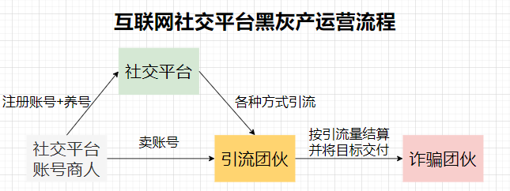
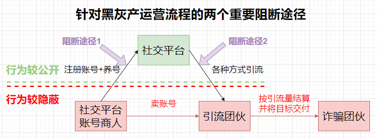
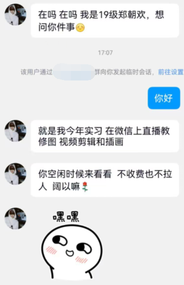
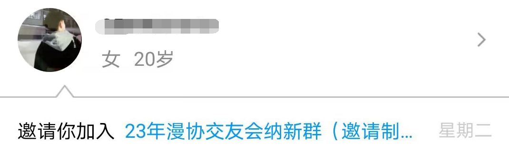
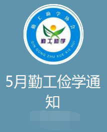

<b style="font-size:2.5em;line-height:1em;font-weight:700">大学校园内互联网社交平台引流诈骗总结报告</b>

<b style="font-size:1.2em">Summary Report of Internet social platform diversion fraud on university campuses</b>

<b style="font-size:2em;font-family:Brush Script MT, Brush Script Std, cursive">For1moc, Scr1w</b>

<b style="font-size:1.5em">摘要</b>

​		本文介绍了黑灰产的基本概念、主要目的、非法牟利手段以及互联网社交平台上的黑灰产运行流程。黑灰产是指利用非法手段或灰色地带运营的产业，其主要目的是通过欺骗、诱导等手段获取非法利益。在大学校园的互联网社交平台上，黑灰产主要通过引流逻辑和心理攻势来吸引用户，包括兼职利诱、假冒权威、推销资源和亚文化社团等手段。引流媒介包括群内广播、群体邀请、私聊和公众号等方式。文章还提供了具体的真实案例，如免费教修图/剪辑等技能、漫协纳新和勤工俭学/兼职广告等。通过了解黑灰产的运作方式，我们可以更好地研究如何反诈以及风控作弊者，尽力避免社交平台用户受到欺诈和非法行为的伤害。

**关键词：黑灰产；非法利益；社交平台；引流；兼职利诱；假冒权威；**

<b style="font-size:1.5em">目录</b>

[TOC]

## 黑灰产简要介绍

### 黑灰产是什么

黑灰产（Black and Gray Industry）是指利用互联网平台进行非法、违规或欺诈性活动的产业。黑灰产包括黑产（Black Industry）和灰产（Gray Industry）两个概念。

黑产指的是以非法手段在互联网上从事各种违法犯罪活动的产业。这些活动包括但不限于网络诈骗、网络赌博、非法贩卖个人信息、恶意软件传播、非法网络交易等。黑产往往通过欺诈、偷盗、虚假宣传等手段牟取非法利益，对用户、企业和社会造成严重的经济和社会危害。

灰产指的是在互联网上进行的一些违规活动，尚未明确违法但存在一定的法律、道德风险的产业。这些活动可能存在法律漏洞或监管不完善，让从业者利用这些漏洞进行牟利。例如，一些灰产活动包括虚假广告、不合规的推广手段、违规内容传播等。灰产的存在使得从业者在法律边缘徘徊，规避监管的同时也给用户带来不良影响。

黑灰产的兴起与互联网的快速发展密切相关，互联网的开放性和匿名性为黑灰产提供了一定的便利条件。黑灰产对互联网的健康发展和用户权益构成威胁，也对正常商业竞争和市场秩序造成破坏。

### 黑灰产的主要目的

互联网平台黑灰产的目的主要是追求经济利益。不法分子利用互联网平台来进行欺诈、诈骗等活动，从中非法牟利。

### 黑灰产非法牟利的手段

黑灰产为了实现非法牟利目的，采用了多种手段。以下是一些常见的手段：

1. 网络诈骗：黑灰产通过虚假宣传、冒充他人身份、利用社交工程等手段诱骗用户提供个人敏感信息，例如银行账户、密码、身份证号码等，进而非法获取财物。
2. 刷单和刷点击：黑灰产利用自动化软件或人工手段，大量制造虚假的交易或点击量，以提高产品或网页的曝光度，骗取广告费用或提高销量。
3. 假冒和盗窃：黑灰产制作假冒的网站、品牌和产品，冒充正规机构或企业，骗取用户信任并获取他们的财务信息或支付信息。
4. 虚假广告：黑灰产利用虚假、夸大的宣传手法，在广告中推销低质量或不存在的产品或服务，欺骗用户进行购买。
5. 虚假交易和网络赌博：黑灰产通过操纵交易数据、虚构交易行为，或者在互联网上组织非法赌博活动，以非法获利。
6. 销售非法商品或服务：黑灰产销售各种非法商品或服务，包括仿制品、非法药品、色情、赌博等，违反法律法规并损害用户权益。
7. 销售个人信息：黑灰产非法获取和销售用户的个人信息，包括姓名、手机号码、地址等，用于进行垃圾短信、诈骗或其他非法活动。

需要注意的是，以上手段仅是一些常见的黑灰产手段，黑灰产将会随着互联网的不断变化而进化，可能会采用新的手段和技术来实现非法牟利的目的。

## 互联网社交平台黑灰产运行流程概览

社交平台由于天然的聊天属性，导致变成了黑灰产广告引流、杀猪盘诈骗最严重的地方。以社交平台中真实用户为目标的黑灰产的运行流程如下：

1. 黑灰产上游账号商人注册大量的虚假账号，然后把这些账号卖给中游引流团伙
2. 引流团伙利用自动化工具和脚本批量的给平台用户发“领四六级资料”或者“勤工俭学/做兼职”等消息内容进行引流到微信群、QQ群甚至其它平台
3. 下游诈骗团伙在微信或者QQ上对引流成功的账号以各种方式进行诈骗

<i>图1 互联网社交平台黑灰产运营流程</i>

当目标受害用户被引流离开社交平台后，一切行为将由引流团伙主导，导致其行动相较社交平台上更加隐蔽，更难被发现。故如果需要对黑灰产的流程进行检测与阻断，则阻断进行在引流以及大量虚假账号的注册这两个环节将最为有效。

<i>图2 针对黑灰产运营流程的两个重要阻断途径</i>

## 引流逻辑与心理攻势

### 兼职利诱

​		以勤工俭学/兼职赚外快为由，大规模发布相关的招聘广告进行引流，随后令目标群体下载各种非法团购APP进行刷单操作等等进一步的收割。

站在诈骗者角度：

1. 诱人的兼职机会：诈骗者发布看似真实的兼职工作机会，通常涉及高薪、灵活的工作时间和轻松的任务。这些工作机会常常被标榜为勤工俭学或额外收入的好方法，以吸引对此感兴趣的人。
2. 低成本宣传：诈骗者常使用由定时脚本操纵的虚假账号在社交媒体内群发广告消息，能够低成本的广泛宣传，进行广撒网。
3. 紧迫感和限时优惠：诈骗者可能采用限时优惠或紧迫感的策略，例如声称只有少数名额可用，或只在有限的时间内接受申请。这种心理策略可以迫使人们匆忙做出决定，从而减少他们对风险的深思熟虑。

站在易受骗者角度：

1. 渴望额外收入：许多学生群体对额外的收入持有渴望，尤其是对低投入高回报的工作怀有幻想。诈骗者会利用这种心理状态，承诺轻松获得高薪的机会，从而引起人们的注意并激发他们的兴趣。

### 假冒权威

​		以假冒权威的话术开头，诈骗者假冒学校内的各种权威，比如学长学姐、勤工俭学相关部门、网信中心机构等。接下来组合别的利诱方式，进行实际的引流诈骗。

站在诈骗者角度：

1. 基于身份的认同和信任：诈骗者试图建立与目标人群的身份认同感和信任关系，通过制造与他们相似的身份或背景，并利用他们对社交证据和推荐的信任，使人们更容易上当受骗。例如最容易的方式是冒充已毕业的学长学姐，讲述一些自己的学习经历等，进一步自证并拉近与目标的关系。
2. 信息不对称性：诈骗者常常宣称自己是某权威，或与某权威有某种特殊联系，同时有一定的伪装技术。在与诈骗者的虚拟账号的私下匿名对话情况下，易受骗者的信息不对称，这种信息不对称导致易受骗者无法轻易核实权威的信息是否伪造。

站在易受骗者角度：

1. 信任权威：学生尤其是低年级新生倾向于信任权威机构或学长学姐的信息和建议。诈骗者利用这一心理倾向，通过假冒权威身份来获取目标人群的信任，使他们更愿意相信和参与诈骗计划。
2. 缺乏核实意愿与手段：学生尤其是低年级新生在面对一个所谓权威时，缺乏第三方网络信息搜集的核实意愿与足够的核实手段，常常不会额外去调查对方机构与身份是否合乎规章制度。

### 推销资源

​		诈骗者极力鼓吹某技能的作用，极力夸大某些声称自己独有的资料的价值。过分夸大社会竞争压力，渲染焦虑氛围，从而以高价格卖出低成本的资源。

站在诈骗者角度：

1. 虚假的资源价值：诈骗者通过各种渠道推销所谓的高质量资源，如四六级资料、教资考试材料等，声称这些资源能够帮助目标人群轻松通过考试并取得好成绩。过分夸大资源的价值和效果，以吸引学生购买。

站在易受骗者角度：

1. 学业焦虑：学生群体由于受到各种升学的压力与考核，以及受到社会对学生群体的唯成绩论的影响，对自己的学业容易产生无由头的严重焦虑。因而容易相信并愿意付出一定的代价获取各类所谓独家资源，以及被严重夸大价值的各类资料。

### 亚文化社团

​		诈骗者将自己伪装成某种亚文化社团的爱好者，以亚文化的传播以及共同的爱好为由进行引流，并进一步组织非法活动来收割。

站在诈骗者角度：

1. 虚假的亚文化社团身份：诈骗者可能以虚构或冒用真实亚文化社团的身份，或者直接使用简单的名称，例如漫协、交友会等，以吸引目标人群的兴趣和参与。他们可能制作虚假的宣传资料、网站页面，宣称提供与亚文化相关的交流、活动或资源。

站在易受骗者角度：

1. 归属感和社交认同：亚文化社团通常是志同道合者相聚的场所，参与者渴望融入和获得归属感。诈骗者利用这种心理需求，声称他们的社团是一个热情友好的社区，加入后可以获得与同好的交流和互动，满足人们的社交认同需求。
2. 热门话题和兴趣追求：亚文化社团通常围绕热门的话题、兴趣爱好或时下流行的动漫、漫画等展开。诈骗者利用这些热门话题和兴趣追求，宣称他们的社团是追求潮流、分享热门资讯的理想场所，吸引目标人群的注意力。

## 引流媒介与具体方式

### 群内广播

​		群内广播主要指的是作弊账号进入目标群，在群内发言，进行引流消息内容的广播。除文字格式以外，同时还会附上图片、群聊分享链接、钓鱼文件等多类型多模态的组合拳。

​		要注意的是这种方式很容易使用脚本来控制账号进行定时任务的消息发送，使得该方式成本很低。

​		这种方式针对新生群、考研群等规模比较大且进入门槛比较低的社交群聊效果拔群。新生群、考研群基本上是一个松散的社交组织，群内成员互相比较陌生，还没有建立起一个统一的价值观和群内秩序，容易滋生各种引流与黑灰产账号。

### 群体邀请

​		群体邀请主要指的是作弊账号进入目标群，对所有群内成员进行邀请入群的发送，试图直接邀请目标进入引流群。

​		这种方式同上，很容易使用脚本批量操作。

### 私聊

​		私聊主要是作弊账号进入目标群与目标进行群内私聊，或者是在引流群内对被引流进来的目标进行群内私聊，进一步引流。

​		这种方式大部分是人工进行，也有一部分使用脚本来发送固定的引流文字序列。

### 公众号

​		公众号，或类似公众号效应的账号，一般常见于校园墙、表白墙等形式。该账号首先在各个泛校园社交群聊内引流校园墙的账号，宣称为校友交流、公布有用校园信息为由，类似打着“交友表白”“校友互助”旗号，利用学校名称、标志或别称，以“校内公共平台”自居。常见的名字包括但不限于某某学校“表白墙”“表黑墙”“树洞”“万能墙”“墙墙墙”等

​		这类自媒体账号借用学校名号，对校内学生有一定影响力，但又通常未获得学校授权，有时候运营团队甚至全部由校外人士组成。这些人员素质参差，企图不明，外加缺乏有效监管，使得各种校园墙一度成为广告营销、黑灰产、造谣信息以及网络暴力的温床。

​		注意，虽然校园墙很多时候不一定是完全打着黑灰产的目的而经营，但鉴于其舆论影响力之大，不得不提防其无意的进行不良舆论导向，或沦为其它黑灰产的引流工具。

## 具体真实案例

### 免费教修图/剪辑等技能

| 引流逻辑          | 具体方式 |
| ----------------- | -------- |
| 假冒权威+推销资源 | 私聊     |

假冒校友身份，利用修图、视频剪辑、插画等技能免费教学来诱惑目标，进行第一步的引流

### 漫协纳新

| 引流逻辑       | 具体方式 |
| -------------- | -------- |
| 亚文化社团纳新 | 群体邀请 |

直接在目标群内进行邀请进群的批量操作

### 勤工俭学/兼职广告

| 引流逻辑          | 具体方式 |
| ----------------- | -------- |
| 假冒权威+兼职利诱 | 群内广播 |

冒充勤工俭学相关部门，以勤工俭学/兼职等为诱惑，群内发消息打广告

> 有想勤工俭学的同学联系我 不用出校 200/天  一做  一结（名额有限）

> 有想勤工俭学的同学联系我 不用出校 200/天 一做 一结（名额有限）

> 勤工俭学十人 日结180+(周末双倍) 无押 暑假也可做 当天结

> 要10个勤工俭学的同学（男女生不限），晚上、周末空闲就行，150-200/日，线上无需出校门，dd我

> 这是咱们勤工俭学服务中心的QQ群，平时要是没事想做兼职的话可以进群了解一下
> 群号：xxxxxxxxx

> 同学们好呀
> 这是咱们学校的勤工俭学协会服务中心QQ群，平时要是没有课了的话，有想勤工俭学的可以进群了解一下哈，明天周四将发布兼职信息♥欢迎👏👏
> 群号：617907864

> 同学们好[CQ:face,id=341]
> 这是咱们勤工俭学服务中心的QQ群，平时要是没有课了的话，有想勤工俭学的可以进群了解一下
> 群号：535528831

> &#91;推荐群聊&#93;请使用最新版本手机QQ查看[CQ:json,data={"app":"com.tencent.troopsharecard"&#44;"desc":""&#44;"bizsrc":""&#44;"view":"contact"&#44;"ver":"1.0.0.30"&#44;"prompt":"推荐群聊"&#44;"appID":""&#44;"sourceName":""&#44;"actionData":""&#44;"actionData_A":""&#44;"sourceUrl":""&#44;"meta":{"contact":{"avatar":"https:\/\/p.qlogo.cn\/gh\/535528831\/535528831\/100"&#44;"contact":""&#44;"jumpUrl":"http:\/\/qm.qq.com\/cgi-bin\/qm\/qr?_wv=1027&amp;k=IDnRRrpugpOTPYEZQP3OftJTxpsasEhI&amp;authKey=RsY0%2B5wSm6b7GFmbbdCXmd3th09GOZT1y8NyJsyHluY7Pd0VfB9PlYQW9n7%2FKObD&amp;noverify=0&amp;group_code=535528831"&#44;"nickname":"勤工俭学服务中心"&#44;"tag":"推荐群聊"&#44;"tagIcon":"https:\/\/p.qlogo.cn\/gh\/535528831\/535528831\/100"}}&#44;"config":{"ctime":1685338543&#44;"token":"e7bb3d6dc44ad7ff683740a12c2d6c88"}&#44;"text":""&#44;"sourceAd":""&#44;"extra":""}]

> ❤️这是咱们学校的勤工俭学服务中心通知QQ群，群内不定时发兼职 （长期短期都是可以）想做的同学进群了解一下哈
> _I.png)明天上午发布兼职公告
> _I.png)群号：101061585

> @全体成员 这是咱们学校的勤工俭学协会QQ群，平时要是没有课了的话，有想勤工俭学的可以进群了解一下，群内不定时发兼职，欢迎各位QQ群:792094128

> 同学们好呀
> 这是咱们学校的勤工俭学协会服务中心QQ群，平时要是没有课了的话，有想勤工俭学的可以进群了解一下哈，暑假假期期间也是可以做的，下周一将发布兼职信息欢迎群号：622672281

> @全体成员 同学们全部进下群明天兼职发放这是学校勤工俭学中心的QQ群，平时要是没有课了的话，有想勤工俭学的同学可以进群了解一下
> 群号:672206371
> (已报备，管理勿撤)

> @全体成员 这是咱们学校的勤工俭学部QQ群，群内不定时发兼职 ，（零碎时间在校也可补贴生活，短期长期都可以）qq群号：733049382

> @全体成员
> 24考研同学可以移步新群：693055715
>
> 1.各种大家复习需要的文具用品，1.9元三支的晨光笔，2.9元一百张的晨光A4纸等等
>
> 2.我们为大家准备了正版资料，涵盖英政数及全部专业课，全部白菜价！买书不花冤枉钱！
>
> 3.公共课资料都是我们呕心沥血整理出来的！各个学院专业课资料免费领取！
>
> 4.无套路，只为大家更好的学习！
>
> 5.学长学姐全程指导大家考研，为大家上岸保驾护航！
>
> 24考研同学可以移步新群：693055715

## 参考资料

[大学新生常见诈骗](https://zhuanlan.zhihu.com/p/553448898)

[大学资料墙，是福音还是骗局？](https://zhuanlan.zhihu.com/p/386199724)

[校园“墙”乱象频生！别让原本单纯快乐的地方变了味！](https://mp.weixin.qq.com/s?__biz=MzUyMzA1MTg4NA==&mid=2247706813&idx=2&sn=786f62328494b222e80ab34965bfc748)